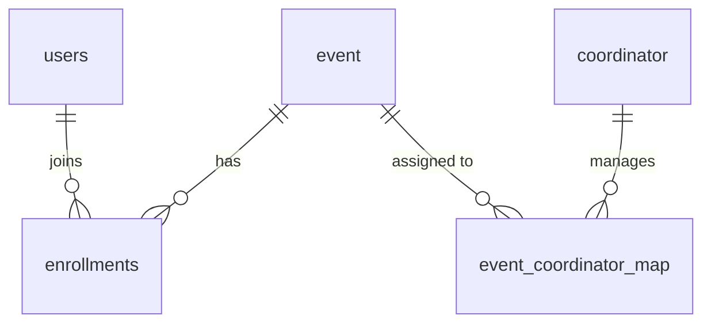

# Smart Event Management System

**TechMarathon – 24 hr Brain Race**

A role-based event management web app built with **PHP** and **MySQL** for the TechMarathon 24-hour hackathon. It has three portals: a **Master Admin** who creates events and coordinators, **Event Coordinators** who run their assigned events, and **Participants** who register, enroll (solo or as a team), pay, and download certificates.


---

## Features

### Master Admin
- Session-based login at `master_admin/index.html`
- Create, edit and delete **events** (name, type, description)
- Add, edit and delete **coordinators**
- **Assign coordinators to events**; each new assignment sends the coordinator an email through PHPMailer
- View all events with their assigned coordinators
- **Analytics dashboard** (Chart.js): event status, attendance, gender split, winners, enrollments per event and withdrawals

### Event Coordinator
- Login at `event_co/index.html`; dashboard shows only the events assigned to you
- **Configure each event:** registration open/close dates, event date, time, location, minimum and maximum participants, fee, individual or team mode, allowed gender
- View the **participant list** for an event
- **Mark attendance** (present) for joined participants
- **Mark winners** (individual or team) and email them a congratulations message
- Per-coordinator stats: assigned events, total registrations, team entries, individual entries and winners

### Participant
- Self-registration (`participants/register.php`) and login at `participants/index.html`
- Dashboard with event counts and a list of events to enroll in
- **Enrollment rules enforced:** registration window, gender restriction, no duplicate enrollment, remaining slots, and team size
- **Team events:** the enrolling user becomes team leader and adds up to four teammates by their registered email
- **Paid events:** Razorpay Checkout when the event has a fee; the payment is saved in the `payments` table
- **Withdraw** from an event (a team leader withdraws the whole team)
- **Certificates:** a printable *Participation* or *Achievement* certificate, available after the event date to participants marked present
- Personal participation stats

## Tech stack

| Layer | Technology |
| --- | --- |
| Backend | PHP 8.x with `mysqli` |
| Database | MySQL / MariaDB (dump generated on MariaDB 10.4, PHP 8.2) |
| Email | PHPMailer 7.0.2 over SMTP (bundled in `PHPMailer/`) |
| Payments | Razorpay Checkout (test mode), Razorpay PHP SDK via Composer |
| Front end | Bootstrap 5.3.2, Font Awesome 6.5.0, Chart.js, Google Fonts (all from CDNs) |

## Getting started

### Prerequisites
- A PHP + MySQL stack such as **XAMPP** or WAMP (Apache, PHP 8.x, MySQL/MariaDB, phpMyAdmin)
- [Composer](https://getcomposer.org/) (only for the Razorpay SDK)
- A Gmail account with an [app password](https://support.google.com/accounts/answer/185833) if you want emails to work

### 1. Clone into your web root
```bash
cd C:/xampp/htdocs        # or /var/www/html
git clone https://github.com/priyanshuverma7667/TechMarathon-24-hr-Brain-Race----Smart-Event-Management-Project.git smart_event
cd smart_event
```

### 2. Create the database
`smart_event.sql` does not create the database itself, so create it first, then import:

```bash
mysql -u root -e "CREATE DATABASE smart_event CHARACTER SET utf8mb4;"
mysql -u root smart_event < smart_event.sql
```

You can do the same in phpMyAdmin (create `smart_event`, then use **Import**). The dump contains sample events, users and enrollments; clear them before using the app for real.

### 3. Configure the database connection
Edit `db.php` if your MySQL settings differ from the defaults (`localhost`, user `root`, empty password, database `smart_event`).

### 4. Create your admin account
The dump includes one sample admin row. To add your own (the app currently hashes passwords with MD5):

```sql
INSERT INTO admin (admin_email, password, admin_name)
VALUES ('admin@example.com', MD5('choose-a-strong-password'), 'Admin');
```

### 5. Set up email (optional)
Emails are sent with PHPMailer through `smtp.gmail.com:587` in two places:

- `main.php` (assignment email when a coordinator is added to an event)
- `event_co/winner.php` (winner notification)

Replace the sender address and app password in both files with your own. Do not commit real credentials; load them from a config file or environment variables instead.

### 6. Set up Razorpay (optional, for paid events)
1. Create a Razorpay account and copy your **test** Key ID and Key Secret.
2. Put your Key ID in `participants/enroll.php` (the `key` option in `payNow()`).
3. Put your Key ID and Key Secret in `participants/create_order.php` and `participants/payment_verification.php`.
4. Install the SDK from the project root:
   ```bash
   composer require razorpay/razorpay
   ```

### 7. Run
Start Apache and MySQL, then open:

| Portal | URL |
| --- | --- |
| Master Admin | `http://localhost/smart_event/master_admin/index.html` |
| Event Coordinator | `http://localhost/smart_event/event_co/index.html` |
| Participant login | `http://localhost/smart_event/participants/index.html` |
| Participant sign-up | `http://localhost/smart_event/participants/register.php` |

## How it works

1. The **admin** creates an event (name, type, description) and a coordinator, then assigns the coordinator to the event.
2. The **coordinator** logs in, opens the event and sets its dates, venue, capacity, fee, mode and gender rules.
3. **Participants** register, find the event on their dashboard and enroll, paying through Razorpay if there is a fee.
4. On event day the coordinator marks attendance and winners.
5. After the event date, present participants download their certificate.

## Request handler

Forms and links post to a single controller, `main.php`, which selects an action with a `flag` query parameter:

| Flag | Action |
| --- | --- |
| `1` | Master admin login |
| `2` | Add event |
| `3` | Assign coordinators to an event (sends email) |
| `4` | Update event details and coordinators |
| `5` | Delete event |
| `6` | Coordinator login |
| `10` | Participant registration |
| `15` | Participant login |
| `16` | Enroll in an event (validation, team members, payment record) |
| `17` | Update coordinator |
| `18` | Delete coordinator |
| `19` | Add coordinator |

## Database

Database name: `smart_event`

| Table | Purpose |
| --- | --- |
| `admin` | Master admin accounts |
| `coordinator` | Event coordinator accounts and contact details |
| `event` | Event details, registration window, capacity, fee, mode, gender rules and status |
| `event_coordinator_map` | Which coordinators are assigned to which events |
| `users` | Participant accounts and profile details |
| `enrollments` | One row per participant per event: team info, status, attendance (`remarks`), winner flag |
| `payments` | Razorpay payment IDs and amounts per user and event |



## Project structure

```
.
├── db.php                      # MySQL connection
├── main.php                    # Central controller (login, events, coordinators, enrollment)
├── smart_event.sql             # Database schema and sample data
├── master_admin/               # Admin portal
│   ├── index.html              # Login
│   ├── dashboard.php, event_view.php, add_event.php, update_event.php
│   ├── add_coordinator.php, edit_coordinator.php, coordinator_list.php
│   ├── event_coordinator.php, assigned_events.php
│   └── analytics.php           # Chart.js dashboard
├── event_co/                   # Coordinator portal
│   ├── index.html              # Login
│   ├── dashboard.php, manage_event.php, participant_list.php
│   ├── mark_present.php, winner.php, stats.php
├── participants/               # Participant portal
│   ├── index.html, register.php
│   ├── dashboard.php, enroll.php, withdraw.php, stats.php
│   ├── create_order.php, payment_verification.php   # Razorpay helpers
│   └── download_certificate.php
└── PHPMailer/                  # Bundled mail library
```

## Before you deploy

This project is a hackathon prototype. Before running it on a public server:

- **Move secrets out of the source code.** Database, SMTP and Razorpay credentials should come from environment variables or an untracked config file. Rotate any credential that has ever been committed.
- **Hash passwords properly.** Replace `md5()` with `password_hash()` and `password_verify()`.
- **Use prepared statements.** Many queries insert request values directly into SQL.
- **Verify payments on the server.** Create the Razorpay order server-side and verify its signature before saving an enrollment.
- **Turn SMTP certificate verification back on** in the PHPMailer options.
- **Limit coordinators to their own events** on the attendance and winner pages.
- **Escape output** with `htmlspecialchars()` wherever user data is printed.
- **Remove the sample data** from the database.

## Credits

Built by [@priyanshuverma7667](https://github.com/priyanshuverma7667). [PHPMailer](https://github.com/PHPMailer/PHPMailer) is bundled under its own license (see `PHPMailer/LICENSE`).
